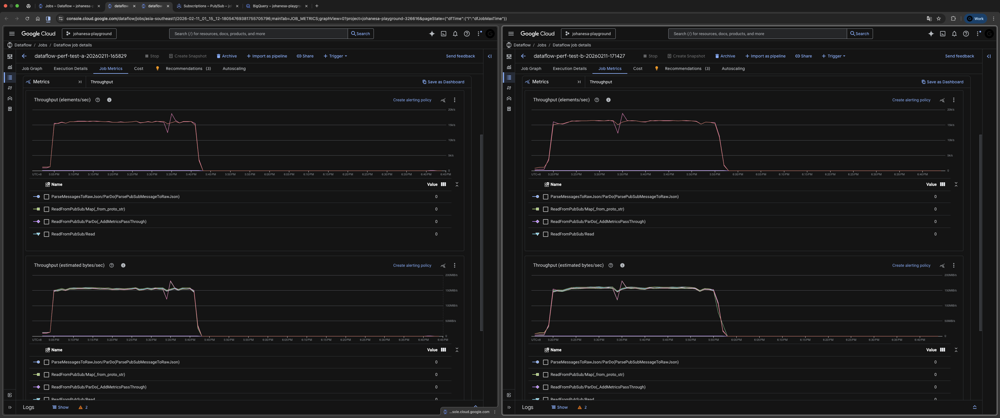
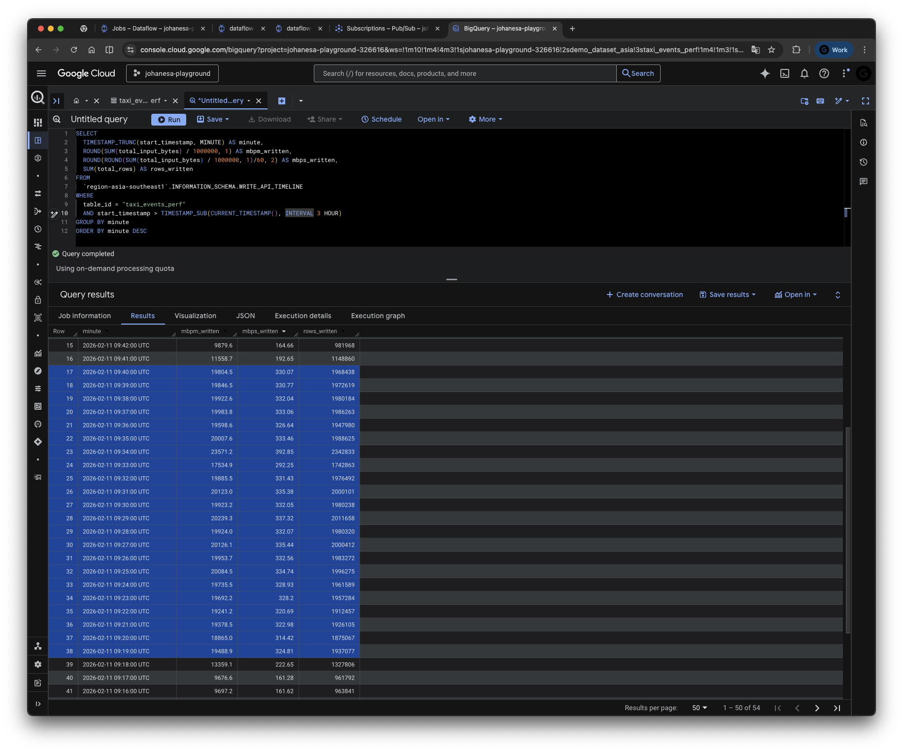

# Performance Test Results -- Round 1 (2-Job Baseline)

Date: 2026-02-11

## Test Environment

| Parameter | Value |
|:---|:---|
| Project ID | `johanesa-playground-326616` |
| Region | `asia-southeast1` |
| Dataset | `demo_dataset_asia` |
| BQ Table | `taxi_events_perf` |
| Pub/Sub Topic | `perf_test_topic` |
| Subscriptions | `perf_test_sub_a`, `perf_test_sub_b` |
| Messages per subscription | 36,000,000 |
| Message size | ~10,000 bytes |
| Total data per subscription | ~360 GB |
| Total data (all subscriptions) | ~720 GB (2 x 360 GB) |

### Sample Row

Each row written to BigQuery has the following structure (JSON column contains the full taxi ride payload with padding):

```json
{
  "subscription_name": "perf_test_sub_a",
  "message_id": "17948491571888611",
  "publish_time": "2026-02-11 08:50:14",
  "processing_time": "2026-02-11 09:32:47",
  "attributes": "{}",
  "payload": {
    "ride_id": "ride-303253",
    "ride_status": "enroute",
    "latitude": 1.333409,
    "longitude": 103.912019,
    "passenger_count": 6,
    "meter_reading": 16.21,
    "meter_increment": 0.0105,
    "point_idx": 1961,
    "timestamp": "2026-02-27T13:10:07.194087+08:00",
    "_padding": "oblijtlglaikebrlt...(~9,500 chars of random padding to reach ~10 KB)"
  }
}
```

### Dataflow Jobs

| Job | Job ID | Name | State |
|:---|:---|:---|:---|
| Publisher (batch) | `2026-02-11_00_38_19-9288093991725141395` | `dataflow-perf-publisher-20260211-163807` | Done |
| Consumer A (streaming) | `2026-02-11_00_59_23-3505550271989959467` | `dataflow-perf-test-a-20260211-165829` | Running |
| Consumer B (streaming) | `2026-02-11_01_15_12-18054769381755705796` | `dataflow-perf-test-b-20260211-171427` | Running |

### Consumer Pipeline Configuration

| Parameter | Value |
|:---|:---|
| Workers per job | 3 |
| Machine type | `n2-standard-4` (4 vCPUs, 16 GB RAM) |
| Pipeline | `pipeline_json.py` (raw JSON to BQ JSON column) |
| BQ write method | `STORAGE_WRITE_API` (exactly-once) |
| Triggering frequency | 1 second |
| `num_storage_write_api_streams` | Not set (Beam auto-sharding) |

## Screenshots

### Dataflow Job Metrics (Job A left, Job B right)



### BigQuery WRITE_API_TIMELINE Query Results



## Timeline Summary

| Phase | Time (UTC) | Duration | Description |
|:---|:---|:---|:---|
| Job A ramp-up | 09:03 | 1 min | Job A starts writing, ramp from 65 to 155 MB/s |
| Job A steady state | 09:04 - 09:17 | 14 min | Job A alone at ~160 MB/s |
| Job B ramp-up | 09:18 | 1 min | Job B starts writing, combined jumps to 222 MB/s |
| Both jobs steady state | 09:19 - 09:40 | 22 min | Combined ~320-335 MB/s, each job ~160 MB/s |
| Job A finishes | 09:41 | 1 min | Sub_a drained, throughput drops to ~165 MB/s |
| Job B alone | 09:42 - 09:55 | 14 min | Job B alone at ~160 MB/s |
| Job B finishes | 09:56 | 1 min | Sub_b drained |

## Raw Data

### BQ Write Throughput

**Query:**

```bash
bq query --use_legacy_sql=false --location=asia-southeast1 --format=pretty '
SELECT
  TIMESTAMP_TRUNC(start_timestamp, MINUTE) AS minute,
  ROUND(SUM(total_input_bytes) / 1000000, 1) AS mbpm_written,
  ROUND(ROUND(SUM(total_input_bytes) / 1000000, 1)/60, 2) AS mbps_written,
  SUM(total_rows) AS rows_written
FROM
  `region-asia-southeast1`.INFORMATION_SCHEMA.WRITE_API_TIMELINE
WHERE
  table_id = "taxi_events_perf"
  AND start_timestamp > TIMESTAMP_SUB(CURRENT_TIMESTAMP(), INTERVAL 3 HOUR)
GROUP BY minute
ORDER BY minute'
```

**Results:**

| Minute (UTC) | MB/min | MB/s | Rows | Phase |
|:---|---:|---:|---:|:---|
| 09:03 | 3,929.0 | 65.48 | 390,516 | Job A ramp-up |
| 09:04 | 9,304.1 | 155.07 | 924,768 | Job A only |
| 09:05 | 9,311.1 | 155.19 | 925,464 | Job A only |
| 09:06 | 9,608.7 | 160.15 | 955,040 | Job A only |
| 09:07 | 9,328.7 | 155.48 | 927,212 | Job A only |
| 09:08 | 9,666.1 | 161.10 | 960,752 | Job A only |
| 09:09 | 9,720.1 | 162.00 | 966,113 | Job A only |
| 09:10 | 9,712.2 | 161.87 | 965,328 | Job A only |
| 09:11 | 9,764.2 | 162.74 | 970,495 | Job A only |
| 09:12 | 9,691.4 | 161.52 | 963,265 | Job A only |
| 09:13 | 9,812.6 | 163.54 | 975,310 | Job A only |
| 09:14 | 9,706.8 | 161.78 | 964,795 | Job A only |
| 09:15 | 9,807.6 | 163.46 | 974,817 | Job A only |
| 09:16 | 9,697.2 | 161.62 | 963,841 | Job A only |
| 09:17 | 9,676.6 | 161.28 | 961,792 | Job A only |
| 09:18 | 13,359.1 | 222.65 | 1,327,806 | Job B ramp-up |
| 09:19 | 19,488.9 | 324.81 | 1,937,077 | Both jobs |
| 09:20 | 18,865.0 | 314.42 | 1,875,067 | Both jobs |
| 09:21 | 19,378.5 | 322.98 | 1,926,105 | Both jobs |
| 09:22 | 19,241.2 | 320.69 | 1,912,457 | Both jobs |
| 09:23 | 19,692.2 | 328.20 | 1,957,284 | Both jobs |
| 09:24 | 19,735.5 | 328.93 | 1,961,589 | Both jobs |
| 09:25 | 20,084.5 | 334.74 | 1,996,275 | Both jobs |
| 09:26 | 19,953.7 | 332.56 | 1,983,272 | Both jobs |
| 09:27 | 20,126.1 | 335.44 | 2,000,412 | Both jobs |
| 09:28 | 19,924.0 | 332.07 | 1,980,320 | Both jobs |
| 09:29 | 20,239.3 | 337.32 | 2,011,658 | Both jobs |
| 09:30 | 19,923.2 | 332.05 | 1,980,238 | Both jobs |
| 09:31 | 20,123.0 | 335.38 | 2,000,101 | Both jobs |
| 09:32 | 19,885.5 | 331.43 | 1,976,492 | Both jobs |
| 09:33 | 17,534.9 | 292.25 | 1,742,863 | Both jobs |
| 09:34 | 23,571.2 | 392.85 | 2,342,833 | Both jobs (peak) |
| 09:35 | 20,007.6 | 333.46 | 1,988,625 | Both jobs |
| 09:36 | 19,598.6 | 326.64 | 1,947,980 | Both jobs |
| 09:37 | 19,983.8 | 333.06 | 1,986,263 | Both jobs |
| 09:38 | 19,922.6 | 332.04 | 1,980,184 | Both jobs |
| 09:39 | 19,846.5 | 330.77 | 1,972,619 | Both jobs |
| 09:40 | 19,804.5 | 330.07 | 1,968,438 | Both jobs |
| 09:41 | 11,558.7 | 192.65 | 1,148,860 | Job A finishing |
| 09:42 | 9,879.6 | 164.66 | 981,968 | Job B only |
| 09:43 | 9,815.6 | 163.59 | 975,607 | Job B only |
| 09:44 | 9,864.9 | 164.41 | 980,512 | Job B only |
| 09:45 | 9,559.4 | 159.32 | 950,144 | Job B only |
| 09:46 | 9,688.4 | 161.47 | 962,962 | Job B only |
| 09:47 | 9,873.3 | 164.55 | 981,344 | Job B only |
| 09:48 | 9,889.9 | 164.83 | 982,992 | Job B only |
| 09:49 | 9,768.4 | 162.81 | 970,921 | Job B only |
| 09:50 | 9,906.8 | 165.11 | 984,672 | Job B only |
| 09:51 | 9,473.4 | 157.89 | 941,597 | Job B only |
| 09:52 | 9,546.8 | 159.11 | 948,896 | Job B only |
| 09:53 | 9,519.4 | 158.66 | 946,171 | Job B only |
| 09:54 | 9,657.3 | 160.95 | 959,879 | Job B only |
| 09:55 | 7,125.9 | 118.77 | 708,272 | Job B finishing |
| 09:56 | 457.0 | 7.62 | 45,424 | Job B finishing |

### Pub/Sub Backlog Drain

**Query:**

```bash
curl -s -H "Authorization: Bearer $(gcloud auth print-access-token)" \
  "https://monitoring.googleapis.com/v3/projects/johanesa-playground-326616/timeSeries?\
filter=metric.type%3D%22pubsub.googleapis.com%2Fsubscription%2Fbacklog_bytes%22\
%20AND%20(resource.labels.subscription_id%3D%22perf_test_sub_a%22\
%20OR%20resource.labels.subscription_id%3D%22perf_test_sub_b%22)\
&interval.startTime=$(date -u -d '3 hours ago' +%Y-%m-%dT%H:%M:%SZ)\
&interval.endTime=$(date -u +%Y-%m-%dT%H:%M:%SZ)\
&aggregation.alignmentPeriod=120s\
&aggregation.perSeriesAligner=ALIGN_MEAN"
```

**Results (2-minute intervals):**

| Time (UTC) | sub_a (GB) | sub_b (GB) | sub_a drain | sub_b drain | Phase |
|:---|---:|---:|---:|---:|:---|
| 09:05 | 360.0 | 360.0 | -- | -- | Job A starting |
| 09:07 | 351.5 | 360.0 | 71 MB/s | -- | Job A ramp-up |
| 09:09 | 332.7 | 360.0 | 157 MB/s | -- | Job A only |
| 09:11 | 313.8 | 360.0 | 157 MB/s | -- | Job A only |
| 09:13 | 294.7 | 360.0 | 159 MB/s | -- | Job A only |
| 09:15 | 275.4 | 360.0 | 161 MB/s | -- | Job A only |
| 09:17 | 256.3 | 360.0 | 159 MB/s | -- | Job A only |
| 09:19 | 236.6 | 360.0 | 164 MB/s | -- | Job A only |
| 09:21 | 217.3 | 359.1 | 161 MB/s | 7 MB/s | Job B starting |
| 09:23 | 197.8 | 345.9 | 162 MB/s | 110 MB/s | Job B ramp-up |
| 09:25 | 179.0 | 327.2 | 156 MB/s | 156 MB/s | Both steady |
| 09:27 | 159.7 | 307.8 | 161 MB/s | 161 MB/s | Both steady |
| 09:29 | 140.2 | 288.2 | 163 MB/s | 163 MB/s | Both steady |
| 09:31 | 120.9 | 268.7 | 161 MB/s | 163 MB/s | Both steady |
| 09:33 | 101.2 | 248.9 | 164 MB/s | 165 MB/s | Both steady |
| 09:35 | 81.9 | 228.9 | 161 MB/s | 167 MB/s | Both steady |
| 09:37 | 63.1 | 210.5 | 157 MB/s | 154 MB/s | Both steady |
| 09:39 | 44.1 | 191.3 | 158 MB/s | 159 MB/s | Both steady |
| 09:41 | 25.0 | 171.7 | 159 MB/s | 164 MB/s | Both steady |
| 09:43 | 6.1 | 151.7 | 158 MB/s | 166 MB/s | Job A finishing |
| 09:45 | 0.0 | 132.2 | 51 MB/s | 163 MB/s | Job A done |
| 09:47 | 0.0 | 112.5 | -- | 164 MB/s | Job B only |
| 09:49 | 0.0 | 92.9 | -- | 163 MB/s | Job B only |
| 09:51 | 0.0 | 73.2 | -- | 164 MB/s | Job B only |
| 09:53 | 0.0 | 53.5 | -- | 164 MB/s | Job B only |
| 09:55 | 0.0 | 34.8 | -- | 155 MB/s | Job B only |
| 09:57 | 0.0 | 15.3 | -- | 163 MB/s | Job B finishing |
| 09:59 | 0.0 | 5.0 | -- | 86 MB/s | Job B finishing |
| 10:01 | 0.0 | 0.0 | -- | 42 MB/s | Done |

### BQ Concurrent Connections

**Query:**

```bash
curl -s -H "Authorization: Bearer $(gcloud auth print-access-token)" \
  "https://monitoring.googleapis.com/v3/projects/johanesa-playground-326616/timeSeries?\
filter=metric.type%3D%22bigquerystorage.googleapis.com%2Fwrite%2Fconcurrent_connections%22\
&interval.startTime=$(date -u -d '3 hours ago' +%Y-%m-%dT%H:%M:%SZ)\
&interval.endTime=$(date -u +%Y-%m-%dT%H:%M:%SZ)\
&aggregation.alignmentPeriod=120s\
&aggregation.perSeriesAligner=ALIGN_MEAN"
```

**Results (2-minute intervals):**

| Time (UTC) | Connections | Phase |
|:---|---:|:---|
| 09:05 | 47 | Job A ramp-up |
| 09:07 | 60 | Job A steady |
| 09:09 - 09:17 | 60 | Job A steady |
| 09:19 | 72 | Job B starting |
| 09:21 - 09:43 | 120 | Both jobs |
| 09:45 | 120 | Job A finishing |
| 09:47 - 10:01 | 60 → 22 | Job B only → finishing |

### Total Rows Verification

**Query:**

```bash
bq query --use_legacy_sql=false --location=asia-southeast1 '
SELECT COUNT(1) AS total_rows
FROM `johanesa-playground-326616.demo_dataset_asia.taxi_events_perf`'
```

**Result:** 72,000,000 rows (36M from sub_a + 36M from sub_b).

### Pub/Sub Backlog Verification (pre-test)

**Query:**

```bash
curl -s -H "Authorization: Bearer $(gcloud auth print-access-token)" \
  "https://monitoring.googleapis.com/v3/projects/johanesa-playground-326616/timeSeries?\
filter=metric.type%3D%22pubsub.googleapis.com%2Fsubscription%2Fbacklog_bytes%22\
%20AND%20(resource.labels.subscription_id%3D%22perf_test_sub_a%22\
%20OR%20resource.labels.subscription_id%3D%22perf_test_sub_b%22)\
&interval.startTime=$(date -u -d '30 minutes ago' +%Y-%m-%dT%H:%M:%SZ)\
&interval.endTime=$(date -u +%Y-%m-%dT%H:%M:%SZ)\
&aggregation.alignmentPeriod=60s\
&aggregation.perSeriesAligner=ALIGN_MEAN"
```

**Result (before consumers started):**

| Subscription | Backlog |
|:---|:---|
| `perf_test_sub_a` | 359.9 GB |
| `perf_test_sub_b` | 359.4 GB |

### Quota Verification

**Query:**

```bash
gcloud alpha services quota list \
  --service=bigquerystorage.googleapis.com \
  --consumer="projects/johanesa-playground-326616" \
  --filter="append_bytes"
```

**Result:**

| Quota | Metric | Limit | Effective MB/s |
|:---|:---|---:|---:|
| US multi-region | `write/append_bytes` | 193,273,528,320 bytes/min | ~3,221 MB/s |
| EU multi-region | `write/append_bytes_eu` | 193,273,528,320 bytes/min | ~3,221 MB/s |
| Regional (asia-southeast1) | `write/append_bytes_region` | 18,874,368,000 bytes/min | ~314.6 MB/s |

The documented quota of "300 MB/s in regions" corresponds to an actual enforced limit of **~314.6 MB/s** (18,874,368,000 bytes/min).

## Analysis

### Phase 1: Job A Alone (09:04 - 09:17)

- Steady-state throughput: **155-163 MB/s** (~160 MB/s average)
- BQ connections: **60** (20 per worker with 3 workers)
- Quota usage: **~54%** of the documented 300 MB/s regional limit
- Pub/Sub drain rate matched BQ write rate exactly -- pipeline is BQ-write-bound, not Pub/Sub-bound

### Phase 2: Both Jobs Running (09:19 - 09:40)

- Combined throughput: **320-335 MB/s** (~330 MB/s average)
- Per-job throughput: **~160 MB/s each** (unchanged from solo baseline)
- BQ connections: **120** (60 per job, doubled)
- Peak throughput: **393 MB/s** at 09:34 (transient)
- Job A's drain rate was unaffected by Job B's presence

### Phase 3: Job B Alone (09:42 - 09:55)

- Throughput: **158-165 MB/s** (identical to Job A's solo performance)
- BQ connections: dropped from 120 to 60
- Confirms symmetric behavior -- neither job has an inherent advantage

### Key Findings

1. **No noisy neighbor effect.** Job A maintained ~160 MB/s whether running alone or alongside Job B. Job B also ran at ~160 MB/s. Neither job degraded the other.

2. **Linear throughput scaling.** Combined throughput was ~330 MB/s (2 x 165 MB/s), which is linear scaling from the single-job baseline.

3. **Exceeded the documented 300 MB/s regional quota.** The combined throughput sustained 320-335 MB/s for over 20 minutes with a peak of 393 MB/s. The 300 MB/s figure in the [BQ quota documentation](https://cloud.google.com/bigquery/quotas#write-api-limits) appears to be a soft limit with burst headroom, not a hard cap.

4. **Connection scaling is linear.** 60 connections per job (20 per worker), 120 combined. Well below the 1,000 regional connection limit.

5. **72M total rows written.** All 36M messages from each subscription were successfully written to BigQuery with zero errors.

## Next: Round 2 (3-Job Quota Test)

Round 2 added a third concurrent job to determine whether the ~300 MB/s regional quota is enforced. With 3 jobs demanding ~480 MB/s, BQ exhibited sawtooth throttling (burst/throttle cycles), confirming that the quota is enforced above ~314 MB/s. However, since the production workload (~200 MB/s combined) is well below this threshold, the quota does not explain the production issue. Combined with round 1's proof of linear scaling at ~330 MB/s, **Dataflow and BigQuery are cleared as the bottleneck** -- the problem is upstream. See [Round 2 results](perf_test_results_round2.md).
