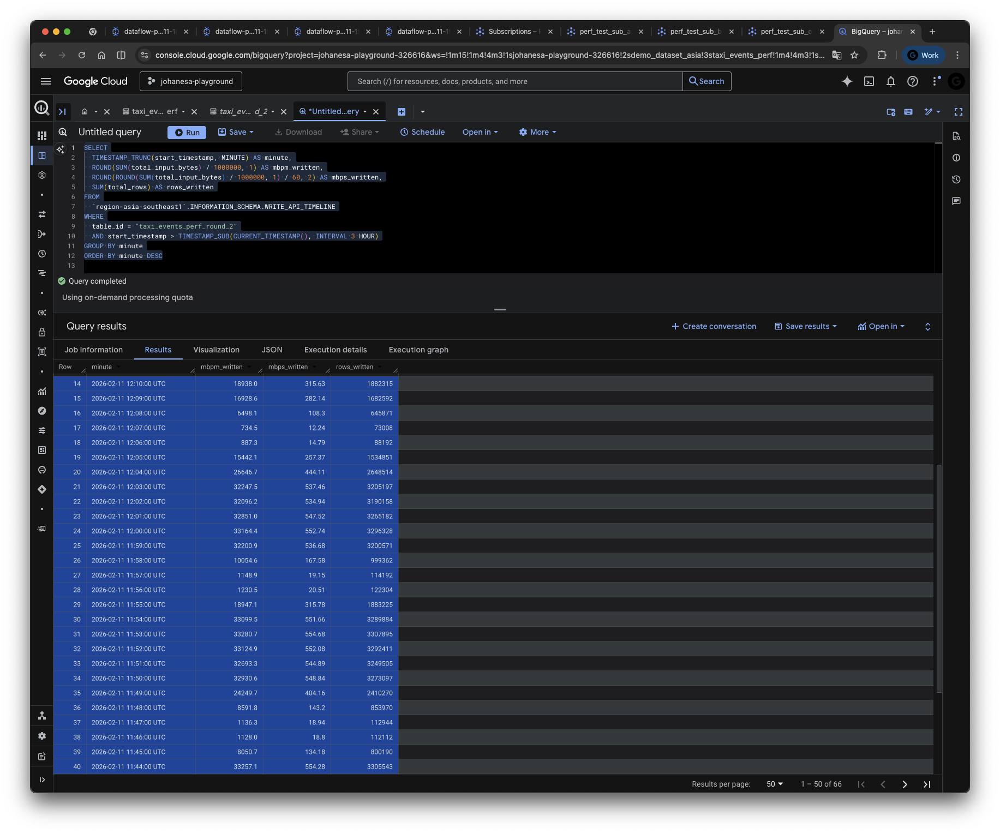

# Performance Test Results -- Round 2 (3-Job Quota Test)

Date: 2026-02-11

## Test Environment

| Parameter | Value |
|:---|:---|
| Project ID | `johanesa-playground-326616` |
| Region | `asia-southeast1` |
| Dataset | `demo_dataset_asia` |
| BQ Table | `taxi_events_perf_round_2` |
| Pub/Sub Topic | `perf_test_topic` |
| Subscriptions | `perf_test_sub_a`, `perf_test_sub_b`, `perf_test_sub_c` |
| Messages per subscription | 36,000,000 |
| Message size | ~10,000 bytes |
| Total data per subscription | ~360 GB |
| Total data (all subscriptions) | ~1,080 GB (3 x 360 GB) |

### Sample Row

Each row written to BigQuery has the following structure (JSON column contains the full taxi ride payload with padding):

```json
{
  "subscription_name": "perf_test_sub_a",
  "message_id": "17949014610735406",
  "publish_time": "2026-02-11 11:05:12",
  "processing_time": "2026-02-11 12:05:00",
  "attributes": "{}",
  "payload": {
    "ride_id": "ride-674165",
    "ride_status": "dropoff",
    "latitude": 1.452581,
    "longitude": 103.864721,
    "passenger_count": 2,
    "meter_reading": 15.3,
    "meter_increment": 0.0296,
    "point_idx": 1573,
    "timestamp": "2026-02-26T23:41:14.905703+08:00",
    "_padding": "itxvvlfpsuzppcnq...(~9,500 chars of random padding to reach ~10 KB)"
  }
}
```

### Dataflow Jobs

| Job | Job ID | Name | State |
|:---|:---|:---|:---|
| Publisher (batch) | `2026-02-11_02_50_41-11903438441739339897` | `dataflow-perf-publisher-20260211-185029` | Done |
| Consumer A (streaming) | `2026-02-11_03_14_53-4730962974822542188` | `dataflow-perf-test-a-20260211-191409` | Running |
| Consumer B (streaming) | `2026-02-11_03_26_19-14018366479996713103` | `dataflow-perf-test-b-20260211-192534` | Running |
| Consumer C (streaming) | `2026-02-11_03_26_23-11083975888231782779` | `dataflow-perf-test-c-20260211-192539` | Running |

### Consumer Pipeline Configuration

| Parameter | Value |
|:---|:---|
| Workers per job | 3 |
| Machine type | `n2-standard-4` (4 vCPUs, 16 GB RAM) |
| Pipeline | `pipeline_json.py` (raw JSON to BQ JSON column) |
| BQ write method | `STORAGE_WRITE_API` (exactly-once) |
| Triggering frequency | 1 second |
| `num_storage_write_api_streams` | Not set (Beam auto-sharding) |

## Screenshots

### Dataflow Job Metrics -- Job A


### Dataflow Job Metrics -- Job B


### Dataflow Job Metrics -- Job C


### BigQuery WRITE_API_TIMELINE Query Results



## Timeline Summary

| Phase | Time (UTC) | Duration | Description |
|:---|:---|:---|:---|
| Job A ramp-up | 11:18 | 1 min | Job A starts writing, ramp from 43 to 157 MB/s |
| Job A steady state | 11:19 - 11:28 | 10 min | Job A alone at ~160 MB/s |
| Jobs B+C ramp-up | 11:29 - 11:31 | 3 min | Jobs B and C start, combined rises to 397 MB/s |
| 3 jobs -- burst 1 | 11:32 - 11:36 | 5 min | Burst at 438-541 MB/s |
| 3 jobs -- throttle 1 | 11:37 - 11:38 | 2 min | BQ throttles to 51-159 MB/s |
| 3 jobs -- burst 2 | 11:39 - 11:44 | 6 min | Burst at 554-579 MB/s (peak) |
| 3 jobs -- throttle 2 | 11:45 - 11:48 | 4 min | BQ throttles to 19-143 MB/s |
| 3 jobs -- burst 3 | 11:49 - 11:54 | 6 min | Burst at 549-555 MB/s |
| 3 jobs -- throttle 3 | 11:55 - 11:58 | 4 min | BQ throttles to 19-316 MB/s |
| 3 jobs -- burst 4 | 11:59 - 12:05 | 7 min | Burst at 535-553 MB/s, Job A finishing |
| 3 jobs -- throttle 4 | 12:06 - 12:08 | 3 min | BQ throttles to 12-108 MB/s |
| 2 jobs (B+C) steady | 12:09 - 12:18 | 10 min | Steady at ~328 MB/s (no throttling) |
| Jobs B+C finishing | 12:19 - 12:23 | 5 min | Drain remaining backlog |

## Raw Data

### BQ Write Throughput

**Query:**

```bash
bq query --use_legacy_sql=false --location=asia-southeast1 --format=pretty '
SELECT
  TIMESTAMP_TRUNC(start_timestamp, MINUTE) AS minute,
  ROUND(SUM(total_input_bytes) / 1000000, 1) AS mbpm_written,
  ROUND(ROUND(SUM(total_input_bytes) / 1000000, 1)/60, 2) AS mbps_written,
  SUM(total_rows) AS rows_written
FROM
  `region-asia-southeast1`.INFORMATION_SCHEMA.WRITE_API_TIMELINE
WHERE
  table_id = "taxi_events_perf_round_2"
  AND start_timestamp > TIMESTAMP_SUB(CURRENT_TIMESTAMP(), INTERVAL 3 HOUR)
GROUP BY minute
ORDER BY minute'
```

**Results:**

| Minute (UTC) | MB/min | MB/s | Rows | Phase |
|:---|---:|---:|---:|:---|
| 11:18 | 2,608.5 | 43.48 | 259,267 | Job A ramp-up |
| 11:19 | 9,401.1 | 156.69 | 934,414 | Job A only |
| 11:20 | 9,439.8 | 157.33 | 938,258 | Job A only |
| 11:21 | 9,640.2 | 160.67 | 958,176 | Job A only |
| 11:22 | 9,353.0 | 155.88 | 929,629 | Job A only |
| 11:23 | 9,620.5 | 160.34 | 956,222 | Job A only |
| 11:24 | 9,553.0 | 159.22 | 949,506 | Job A only |
| 11:25 | 9,849.3 | 164.16 | 978,961 | Job A only |
| 11:26 | 9,900.9 | 165.01 | 984,085 | Job A only |
| 11:27 | 9,975.8 | 166.26 | 991,531 | Job A only |
| 11:28 | 9,919.0 | 165.32 | 985,884 | Job A only |
| 11:29 | 14,797.5 | 246.63 | 1,470,774 | B+C ramp-up |
| 11:30 | 22,493.2 | 374.89 | 2,235,682 | B+C ramp-up |
| 11:31 | 23,834.0 | 397.23 | 2,368,953 | B+C ramp-up |
| 11:32 | 26,303.2 | 438.39 | 2,614,377 | Burst 1 |
| 11:33 | 26,631.8 | 443.86 | 2,647,035 | Burst 1 |
| 11:34 | 26,349.0 | 439.15 | 2,618,920 | Burst 1 |
| 11:35 | 30,976.1 | 516.27 | 3,078,834 | Burst 1 |
| 11:36 | 32,451.6 | 540.86 | 3,225,481 | Burst 1 |
| 11:37 | 3,056.0 | 50.93 | 303,749 | Throttle 1 |
| 11:38 | 9,567.8 | 159.46 | 950,975 | Throttle 1 |
| 11:39 | 33,906.7 | 565.11 | 3,370,110 | Burst 2 |
| 11:40 | 34,764.4 | 579.41 | 3,455,360 | Burst 2 (peak) |
| 11:41 | 33,475.0 | 557.92 | 3,327,204 | Burst 2 |
| 11:42 | 33,234.0 | 553.90 | 3,303,248 | Burst 2 |
| 11:43 | 33,405.7 | 556.76 | 3,320,314 | Burst 2 |
| 11:44 | 33,257.1 | 554.28 | 3,305,543 | Burst 2 |
| 11:45 | 8,050.7 | 134.18 | 800,190 | Throttle 2 |
| 11:46 | 1,128.0 | 18.80 | 112,112 | Throttle 2 |
| 11:47 | 1,136.3 | 18.94 | 112,944 | Throttle 2 |
| 11:48 | 8,591.8 | 143.20 | 853,970 | Throttle 2 |
| 11:49 | 24,249.7 | 404.16 | 2,410,270 | Burst 3 |
| 11:50 | 32,930.6 | 548.84 | 3,273,097 | Burst 3 |
| 11:51 | 32,693.3 | 544.89 | 3,249,505 | Burst 3 |
| 11:52 | 33,124.9 | 552.08 | 3,292,411 | Burst 3 |
| 11:53 | 33,280.7 | 554.68 | 3,307,895 | Burst 3 |
| 11:54 | 33,099.5 | 551.66 | 3,289,884 | Burst 3 |
| 11:55 | 18,947.1 | 315.78 | 1,883,225 | Throttle 3 |
| 11:56 | 1,230.5 | 20.51 | 122,304 | Throttle 3 |
| 11:57 | 1,148.9 | 19.15 | 114,192 | Throttle 3 |
| 11:58 | 10,054.6 | 167.58 | 999,362 | Throttle 3 |
| 11:59 | 32,200.9 | 536.68 | 3,200,571 | Burst 4 |
| 12:00 | 33,164.4 | 552.74 | 3,296,328 | Burst 4 |
| 12:01 | 32,851.0 | 547.52 | 3,265,182 | Burst 4 |
| 12:02 | 32,096.2 | 534.94 | 3,190,158 | Burst 4 |
| 12:03 | 32,247.5 | 537.46 | 3,205,197 | Burst 4 |
| 12:04 | 26,646.7 | 444.11 | 2,648,514 | Burst 4 (Job A finishing) |
| 12:05 | 15,442.1 | 257.37 | 1,534,851 | Job A finishing |
| 12:06 | 887.3 | 14.79 | 88,192 | Throttle 4 |
| 12:07 | 734.5 | 12.24 | 73,008 | Throttle 4 |
| 12:08 | 6,498.1 | 108.30 | 645,871 | Throttle 4 |
| 12:09 | 16,928.6 | 282.14 | 1,682,592 | 2 jobs ramp |
| 12:10 | 18,938.0 | 315.63 | 1,882,315 | 2 jobs (B+C) |
| 12:11 | 19,649.9 | 327.50 | 1,953,079 | 2 jobs (B+C) |
| 12:12 | 19,558.6 | 325.98 | 1,944,003 | 2 jobs (B+C) |
| 12:13 | 19,711.5 | 328.52 | 1,959,203 | 2 jobs (B+C) |
| 12:14 | 19,656.0 | 327.60 | 1,953,687 | 2 jobs (B+C) |
| 12:15 | 19,691.3 | 328.19 | 1,957,195 | 2 jobs (B+C) |
| 12:16 | 19,648.0 | 327.47 | 1,952,887 | 2 jobs (B+C) |
| 12:17 | 19,679.7 | 328.00 | 1,956,041 | 2 jobs (B+C) |
| 12:18 | 19,710.4 | 328.51 | 1,959,085 | 2 jobs (B+C) |
| 12:19 | 15,890.8 | 264.85 | 1,579,446 | Jobs B+C finishing |
| 12:20 | 10,301.9 | 171.70 | 1,023,940 | Jobs B+C finishing |
| 12:21 | 6,785.0 | 113.08 | 674,389 | Jobs B+C finishing |
| 12:22 | 1,691.4 | 28.19 | 168,119 | Jobs B+C finishing |
| 12:23 | 136.9 | 2.28 | 13,607 | Done |

### Pub/Sub Backlog Drain

**Query:**

```bash
curl -s -H "Authorization: Bearer $(gcloud auth print-access-token)" \
  "https://monitoring.googleapis.com/v3/projects/johanesa-playground-326616/timeSeries?\
filter=metric.type%3D%22pubsub.googleapis.com%2Fsubscription%2Fbacklog_bytes%22\
%20AND%20(resource.labels.subscription_id%3D%22perf_test_sub_a%22\
%20OR%20resource.labels.subscription_id%3D%22perf_test_sub_b%22\
%20OR%20resource.labels.subscription_id%3D%22perf_test_sub_c%22)\
&interval.startTime=$(date -u -d '3 hours ago' +%Y-%m-%dT%H:%M:%SZ)\
&interval.endTime=$(date -u +%Y-%m-%dT%H:%M:%SZ)\
&aggregation.alignmentPeriod=120s\
&aggregation.perSeriesAligner=ALIGN_MEAN"
```

**Results (2-minute intervals):**

| Time (UTC) | sub_a (GB) | sub_b (GB) | sub_c (GB) | Phase |
|:---|---:|---:|---:|:---|
| 11:17 | 360.0 | 360.0 | 360.0 | Pre-test |
| 11:19 | 360.0 | 360.0 | 360.0 | Job A starting |
| 11:21 | 352.3 | 360.0 | 360.0 | Job A only |
| 11:23 | 334.3 | 360.0 | 360.0 | Job A only |
| 11:25 | 314.3 | 360.0 | 360.0 | Job A only |
| 11:27 | 296.1 | 360.0 | 360.0 | Job A only |
| 11:29 | 275.5 | 360.0 | 360.0 | Job A only |
| 11:31 | 256.0 | 359.9 | 360.0 | B+C starting |
| 11:33 | 237.3 | 350.4 | 357.1 | B+C ramp-up |
| 11:35 | 216.8 | 333.7 | 348.7 | 3 jobs -- burst 1 |
| 11:37 | 198.1 | 320.0 | 331.6 | 3 jobs -- throttle 1 |
| 11:39 | 181.1 | 302.3 | 317.0 | 3 jobs -- burst 2 |
| 11:41 | 173.5 | 293.3 | 308.0 | 3 jobs -- burst 2 |
| 11:43 | 155.6 | 279.3 | 291.7 | 3 jobs -- burst 2 |
| 11:45 | 135.2 | 260.1 | 275.5 | 3 jobs -- throttle 2 |
| 11:47 | 117.8 | 240.4 | 253.6 | 3 jobs -- throttle 2 |
| 11:49 | 115.3 | 230.1 | 248.2 | 3 jobs -- burst 3 |
| 11:51 | 111.7 | 229.5 | 246.5 | 3 jobs -- burst 3 |
| 11:53 | 96.1 | 218.8 | 231.9 | 3 jobs -- burst 3 |
| 11:55 | 75.7 | 199.4 | 216.2 | 3 jobs -- throttle 3 |
| 11:57 | 57.3 | 179.9 | 193.9 | 3 jobs -- throttle 3 |
| 11:59 | 52.9 | 166.7 | 185.8 | 3 jobs -- burst 4 |
| 12:01 | 46.8 | 165.9 | 183.4 | 3 jobs -- burst 4 |
| 12:03 | 29.4 | 153.5 | 181.1 | 3 jobs -- burst 4 |
| 12:05 | 9.2 | 134.2 | 154.7 | Job A finishing |
| 12:07 | 0.3 | 115.3 | 135.6 | Throttle 4 |
| 12:09 | 0.0 | 101.4 | 121.0 | 2 jobs (B+C) |
| 12:11 | 0.0 | 100.5 | 119.9 | 2 jobs (B+C) |
| 12:13 | 0.0 | 89.1 | 108.4 | 2 jobs (B+C) |
| 12:15 | 0.0 | 69.8 | 89.5 | 2 jobs (B+C) |
| 12:17 | 0.0 | 50.0 | 70.9 | 2 jobs (B+C) |
| 12:19 | 0.0 | 30.6 | 51.7 | 2 jobs (B+C) |
| 12:21 | 0.0 | 11.4 | 32.6 | Jobs B+C finishing |
| 12:23 | 0.0 | 0.3 | 13.1 | Jobs B+C finishing |
| 12:25 | 0.0 | 0.0 | 4.0 | Job C finishing |
| 12:27 | 0.0 | 0.0 | 0.0 | Done |

### BQ Concurrent Connections

**Query:**

```bash
curl -s -H "Authorization: Bearer $(gcloud auth print-access-token)" \
  "https://monitoring.googleapis.com/v3/projects/johanesa-playground-326616/timeSeries?\
filter=metric.type%3D%22bigquerystorage.googleapis.com%2Fwrite%2Fconcurrent_connections%22\
&interval.startTime=$(date -u -d '3 hours ago' +%Y-%m-%dT%H:%M:%SZ)\
&interval.endTime=$(date -u +%Y-%m-%dT%H:%M:%SZ)\
&aggregation.alignmentPeriod=120s\
&aggregation.perSeriesAligner=ALIGN_MEAN"
```

**Results (2-minute intervals):**

| Time (UTC) | Connections | Phase |
|:---|---:|:---|
| 11:19 | 18 | Job A ramp-up |
| 11:21 - 11:29 | 60 | Job A steady |
| 11:31 | 120 | Jobs B+C starting |
| 11:33 - 12:11 | 180 | All 3 jobs |
| 12:13 | 148 | Job A finishing |
| 12:15 | 139 | Job A finishing |
| 12:17 | 131 | Transitioning |
| 12:19 - 12:25 | 120 | 2 jobs (B+C) |
| 12:27 | 113 | Jobs finishing |
| 12:29 | 80 | Jobs finishing |
| 12:31 | 39 | Jobs finishing |
| 12:33 | 18 | Jobs finishing |

### Total Rows Verification

**Query:**

```bash
bq query --use_legacy_sql=false --location=asia-southeast1 '
SELECT COUNT(1) AS total_rows
FROM `johanesa-playground-326616.demo_dataset_asia.taxi_events_perf_round_2`'
```

**Result:** 108,000,000 rows (36M from sub_a + 36M from sub_b + 36M from sub_c).

### Quota Verification

**Query:**

```bash
gcloud alpha services quota list \
  --service=bigquerystorage.googleapis.com \
  --consumer="projects/johanesa-playground-326616" \
  --filter="append_bytes"
```

**Result:**

| Quota | Metric | Limit | Effective MB/s |
|:---|:---|---:|---:|
| US multi-region | `write/append_bytes` | 193,273,528,320 bytes/min | ~3,221 MB/s |
| EU multi-region | `write/append_bytes_eu` | 193,273,528,320 bytes/min | ~3,221 MB/s |
| Regional (asia-southeast1) | `write/append_bytes_region` | 18,874,368,000 bytes/min | ~314.6 MB/s |

The documented quota of "300 MB/s in regions" corresponds to an actual enforced limit of **~314.6 MB/s** (18,874,368,000 bytes/min).

## Analysis

### Phase 1: Job A Alone (11:19 - 11:28)

- Steady-state throughput: **155-166 MB/s** (~161 MB/s average)
- BQ connections: **60** (20 per worker with 3 workers)
- Quota usage: **~51%** of the 314.6 MB/s regional limit
- Consistent with round 1 baseline (~160 MB/s)

### Phase 2: Three Jobs Running (11:29 - 12:05)

With all 3 jobs writing, throughput exhibited a **sawtooth throttling pattern** -- repeating cycles of burst and throttle:

| Cycle | Burst Period | Burst MB/s | Throttle Period | Throttle MB/s |
|:---|:---|---:|:---|---:|
| 1 | 11:32 - 11:36 (5 min) | 438-541 | 11:37 - 11:38 (2 min) | 51-159 |
| 2 | 11:39 - 11:44 (6 min) | 554-579 | 11:45 - 11:48 (4 min) | 19-143 |
| 3 | 11:49 - 11:54 (6 min) | 549-555 | 11:55 - 11:58 (4 min) | 19-316 |
| 4 | 11:59 - 12:05 (7 min) | 535-553 | 12:06 - 12:08 (3 min) | 12-108 |

- Peak instantaneous throughput: **579 MB/s** at 11:40 (1.84x the quota)
- Sustained burst throughput: **~550 MB/s** during burst phases
- BQ connections: **180** (60 per job, 3 jobs)
- All three subscriptions drained concurrently

**Average throughput across burst/throttle cycles (11:29 - 12:08):**

Total data written in this 39-minute window: ~843,000 MB. Average: **~360 MB/s** (~1.14x the quota).

The sawtooth pattern indicates BQ uses a **token-bucket / sliding-window** quota enforcement mechanism. It accumulates "credit" during throttle phases, then allows bursts that significantly exceed the per-minute quota, while keeping the longer-term average near the quota limit.

### Phase 3: Two Jobs Running (12:09 - 12:18)

After Job A drained its backlog, Jobs B and C continued:

- Steady-state throughput: **326-329 MB/s** (~328 MB/s average)
- BQ connections: **120** (60 per job, 2 jobs)
- **No sawtooth throttling** -- throughput was stable and consistent
- Consistent with round 1's 2-job phase (~330 MB/s)

This confirms that 2 jobs at ~160 MB/s each (~320 MB/s combined) sit just above the 314.6 MB/s quota without triggering aggressive throttling. The system tolerates modest overages (~5%) without visible enforcement.

### Phase 4: Jobs Finishing (12:19 - 12:23)

- Throughput declines as backlogs drain
- All 108M rows written with zero errors

### Key Findings

1. **Quota enforcement is real but uses burst/throttle cycles, not hard rejection.** BQ allows sustained bursts of ~550 MB/s (1.75x the quota) for 5-7 minutes, then throttles to ~20 MB/s for 2-4 minutes. No errors are returned -- the write streams simply slow down.

2. **The sawtooth pattern is how BQ enforces the regional quota above ~314 MB/s.** This throttling only occurs when combined demand exceeds the quota. The production workload (~200 MB/s combined) is well below this threshold and would not trigger sawtooth behavior. This finding is relevant for future scaling but does not explain the current production issue.

3. **Average throughput aligns with quota.** Despite burst peaks of 579 MB/s, the average throughput across the entire 3-job phase was ~360 MB/s -- only ~14% above the 314.6 MB/s quota. BQ's enforcement window is approximately 8-10 minutes.

4. **Two jobs do not trigger throttling.** The 2-job phase (B+C at ~328 MB/s) ran without any sawtooth behavior, suggesting BQ tolerates modest overages (~5% above quota) without enforcement.

5. **No per-table contention.** Each job individually maintained ~160 MB/s whether running alone or alongside other jobs. The throughput degradation is purely quota-driven, not per-table lock contention.

6. **Connection scaling remains linear.** 60 connections per job (20 per worker), 180 combined for 3 jobs. Well below the 1,000 regional connection limit (18% utilization).

7. **108M total rows written.** All 36M messages from each of the 3 subscriptions were successfully written to BigQuery with zero errors and zero DLQ entries.

### Comparison with Round 1

| Metric | Round 1 (2 jobs) | Round 2 (3 jobs) |
|:---|:---|:---|
| Single-job throughput | ~160 MB/s | ~161 MB/s |
| Combined throughput | ~330 MB/s (stable) | ~550 MB/s burst / ~360 MB/s avg |
| Throttling observed | No | Yes (sawtooth pattern) |
| Connections | 120 | 180 |
| Per-job degradation | None | None (per-job rate unchanged) |
| Quota exceedance | ~5% above | ~14% average, ~84% burst peak |
| Total rows | 72M | 108M |

## Diagnosis

**Dataflow and BigQuery are not the bottleneck.**

This test proved that Dataflow + BigQuery scale linearly and can saturate the regional throughput quota:

| Metric | This Test | Production | Implication |
|:---|:---|:---|:---|
| Single-job throughput | ~160 MB/s | ~100 MB/s | Production jobs underperform by ~60 MB/s |
| 2-job combined | ~330 MB/s (linear) | ~120 MB/s | Production issue is not BQ contention |
| Quota threshold | ~314.6 MB/s | ~200 MB/s demand | Production is well below quota |
| Connections | 180 (18% of 1,000) | Lower | Not a factor |

The production scenario (2 jobs at ~100 MB/s each, ~120 MB/s combined instead of ~200 MB/s) cannot be explained by BigQuery per-table contention, connection limits, or throughput quota enforcement. Round 1 demonstrated that 2 jobs writing to the same table at ~160 MB/s each (~330 MB/s combined) run with zero degradation -- well above the production workload.

The bottleneck is **upstream** of Dataflow and BigQuery. Likely candidates include Kafka consumer configuration, Avro deserialization overhead, pipeline transform logic, or network constraints between Kafka and Dataflow workers.

### Secondary Finding: Quota Enforcement Mechanism

When combined demand exceeds ~314 MB/s (as in this 3-job test), BigQuery enforces the regional quota via sawtooth burst/throttle cycles. This is documented here for future scaling reference but is not relevant to the current production issue at ~200 MB/s.

## Recommendations

1. **Investigate the upstream bottleneck.** Each Dataflow job should achieve ~160 MB/s based on this test. The production jobs only achieve ~100 MB/s each -- the ~60 MB/s per-job gap points to Kafka consumer configuration, Avro deserialization overhead, pipeline transform logic, or network constraints.

2. **Profile the production pipeline** to identify where throughput is lost compared to the ~160 MB/s baseline established in this test. Key areas to examine: Kafka consumer fetch settings, Avro decode CPU cost, and any per-record transforms between source and BQ sink.

3. **Monitor quota usage** with alerts on `bigquerystorage.googleapis.com/write/append_bytes_region` as a best practice for capacity planning.

4. **Quota increase or multi-region** is only needed if future scaling pushes combined throughput past ~314 MB/s. At current production volumes (~200 MB/s), the regional quota is not a constraint.
